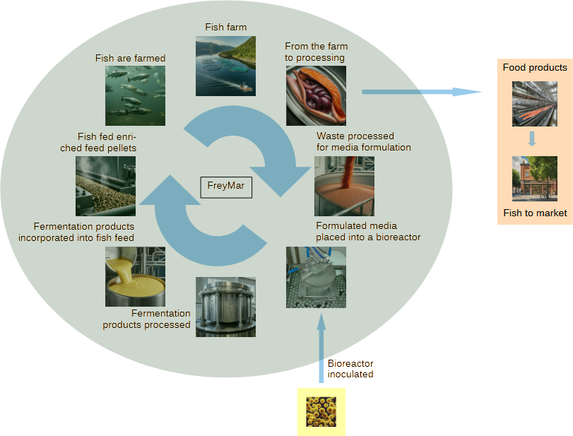

<html lang="en">

<h2>FreyMar's regeneration cycle for aquaculture</h2>

 

<h4>FreyMar's mission is to regenerate slaughter waste from the aquaculture industry to produce enriched fish feed. The slaughter waste is formulated into microbial media that in turn is placed into a bioreactor. The reactor is inoculated with a strain of microbes that produce large quantities of omega-3 polyunsaturated fatty acids (PUFAs). The PFUAs are essential for healthy fish growth in aquaculture. Currently, fish meal and fish oils are the source of PUFAs. FreyMar's technology goes straight to the primary source of PUFAs, marine microbes. FreyMar’s technology regenerates aquaculture waste that otherwise would go to a landfill making the industry sustainable.</h4>

</html>

<!-- Footer -->
<html lang="en">
<head>
    <meta charset="UTF-8">
    <meta name="viewport" content="width=device-width, initial-scale=1.0">
    <link rel="stylesheet" href="Styles-FrMr.css">
    <title>My Website</title>
</head>
<body>
    <!-- Your website content goes here -->
    <footer>
          
<a href="mailto:mostinn@gmail.com"><b>Contact FreyMar!</b></a>

          
© 2024 Magnús Örn Stefánsson
 
    </footer>
</body>
</html>