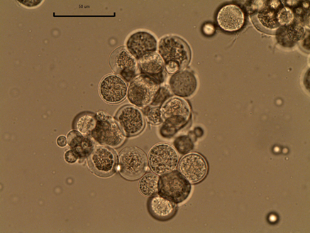
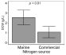
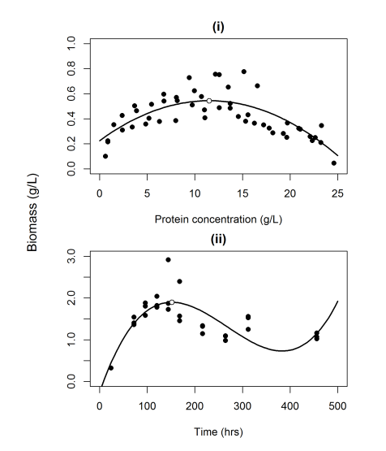
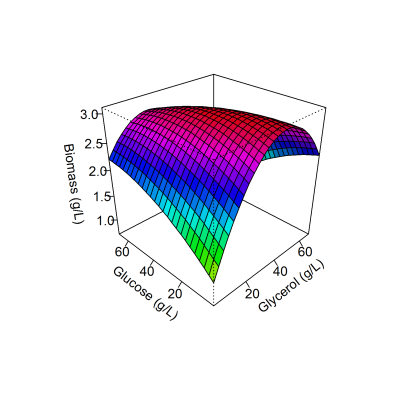
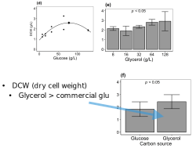
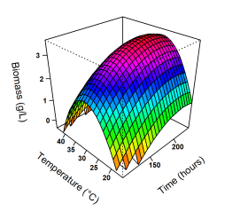
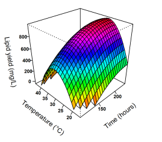
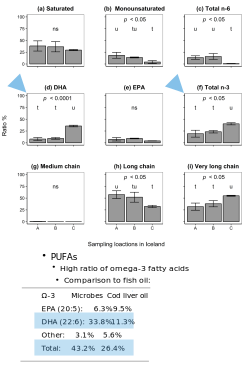

```html

<html lang="en">
<h1>Marine microbes</h1>
<thead>
    <title>Table: Thraustar and bullets</title>
    <link rel="stylesheet" href="Styles-FrMr.css">
</thead>
<tbody>
    <body>
        <div class="table_tech"></div>
        <table class="table_tech">
            <tr>
                <td>
                </td>
                <td>
                    <b>Microbes</b>
                    <br>&bull; Isolated novel strains of marine microbes
                    <br>&bull; Described the evolutionary history of Thraustochytrids
                </td>
            </tr>
        </table>
    </body>
    <h1>Slaughter waste as nitrogen source for microbes</h1>
    <h2>Growth rate on commercial and FreyMar's media</h2>
    <figure class="img-container_tech">
        
    </figure>
    <h1>R&D: Optimization of microbial bioprocessing</h1>
    <h2>Biomass and protein in media</h2>
    <thead>
        <title>Table: Biomass, protein, glucose, gclyerol</title>
        <link rel="stylesheet" href="Styles-FrMr.css">
    </thead>
<tbody>
    <body>
        <div class="table_tech"></div>
        <table class="table_tech">
            <tr>
                <td>
                </td>
                <td>
                    <b>Biomass (DCW, g/L)</b>
                    <br>&bull; With protein concentration
                    <br>&bull; With fermentation time
                </td>
            </tr>
        </table>
    </body>
</tbody>
<thead>
    <title>Table: Biomass, protein, glucose, gclyerol</title>
    <link rel="stylesheet" href="Styles-FrMr.css">
</thead>
<tbody>
    <body>
        <h2>Biomass and carbon source</h2>
        <div class="table_tech"></div>
        <table class="table_tech">
            <tr>
                <td>
                </td>
                <td>
                    <b>Bioimass (DCW, g/L)</b>
                    <br>&bull; With glucose concentration
                    <br>&bull; With glycerol concentration
                </td>
            </tr>
        </table>
    </body>
</tbody>
<h3>Carbon source: Biodiesel production waste</h3>
<figure class="img-container_tech">
    
</figure>
<h2>Biomass and environmental parameters</h2>
<thead>
    <title>Table: Biomass, protein, glucose, gclyerol</title>
    <link rel="stylesheet" href="Styles-FrMr.css">
</thead>
<tbody>
    <body>
        <div class="table_tech"></div>
        <table class="table_tech">
            <tr>
                <td>
                </td>
                <td>
                    <b>Biomass (DCW, g/L)</b>
                    <br>&bull; With temperature
                    <br>&bull; With reaction time
                </td>
            </tr>
        </table>
    </body>
</tbody>
<h2>Lipid synthesis of microbes</h2>
<thead>
    <title>Table: Biomass, protein, glucose, gclyerol</title>
    <link rel="stylesheet" href="Styles-FrMr.css">
</thead>
<tbody>
    <body>
        <div class="table_tech"></div>
        <table class="table_tech">
            <tr>
                <td>
                </td>
                <td>
                    <b>Lipid ratio (mg/L)</b>
                    <br>&bull; With temperature
                    <br>&bull; With reaction time
                </td>
            </tr>
            </tr>
        </table>
    </body>
</tbody>
<!-- #_FA-->
<h3>Fatty acid composition of the marine microbes</h3>
<figure class="img-container_tech">
    
</figure>
<p align="right" style="font-size: 10px;"><a href="https://www.mdpi.com/1660-3397/17/8/449" target="_blank">Stefansson
        <i>et al.</i> Mar.Drugs, 2019</a></p>


<!-- Footer: -->

<head>
    <meta charset="UTF-8">
    <meta name="viewport" content="width=device-width, initial-scale=1.0">
    <link rel="stylesheet" href="Styles-FrMr.css">
    <title>My Website</title>
</head>

<body>
    <!-- Your website content goes here -->
    <footer>
        <p><a href="mailto:mostinn@gmail.com"><b>Contact FreyMar!</b></a></p>
        <p>© 2024 Magnús Örn Stefánsson</p>
    </footer>
</body>

</html>